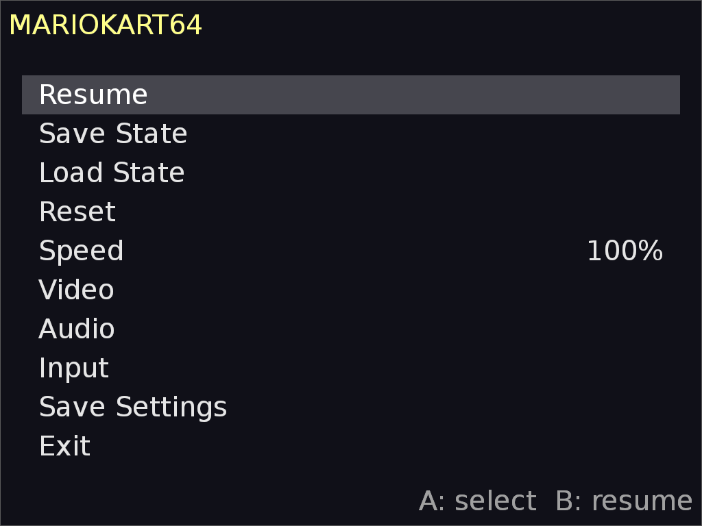
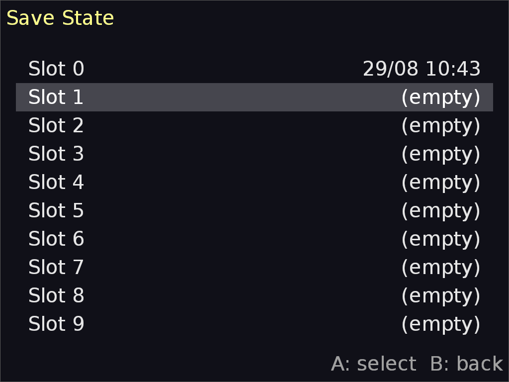
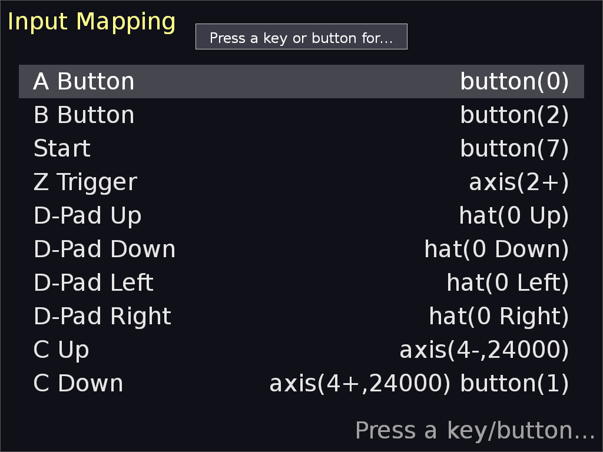

# N64UI

A mupen64plus frontend for the TrimUI Brick with an in-game menu: pause,
save/load states, speed control, per-game video/audio settings and full
input remapping. Ships with both the **glide64mk2** and **Rice** video
plugins.





## Features

- In-game menu via the **Menu** button (F2): pause, save/load (10 slots
  each), reset, speed, video/audio settings, input mapping
- **glide64mk2** (default) and **Rice** video plugins, both accelerated
  (GLES)
- **Analog control via the D-Pad** (F1 toggles D-Pad → analog at the
  hardware level; the menu's analog entries auto-pair both directions)
- Per-game settings stored by ROM
- Muted, glitch-free pause on both the Brick and desktop

## Installation

1. Download `release.tar.gz` from the
   [Releases](https://github.com/your-account/n64ui/releases) page.
2. Extract it into the SD card's `Emus` folder:

   ```
   tar xzf release.tar.gz -C /mnt/SDCARD/Emus/
   ```

   This creates `Emus/N64/` with the emulator directory, launcher scripts,
   configs and the `n64ui-test/` payload.

3. In the TrimUI launcher, open **N64** and pick:
   - **N64UI (glide64mk2)** — default plugin
   - **N64UI (Rice)** — Rice plugin

## Usage

| Button        | Action                        |
| ------------- | ----------------------------- |
| Menu (F2)     | open / close the in-game menu |
| D-Pad         | navigate / analog stick       |
| A             | select                        |
| B             | back                          |

The game pauses whenever the menu is open. Save/Load pick from 10 slots;
input mapping is under **Menu → Input** (L2/R2 map to trigger axes, F1
converts the D-Pad to analog for the stick entries).

## Building from source

Requirements: Docker (the toolchain image is
`aradhyac9/mupen64plus-builder-toolchain:gcc16`), git submodules.

```
git submodule update --init --recursive
bash build.sh release          # full release -> dist/release.tar.gz
bash build.sh release-clean    # undo build outputs / applied patches
```

`build.sh release` builds the mupen64plus core + plugins and the n64ui
frontend inside the Docker toolchain, strips everything, assembles the
`Emus/N64/` directory structure and tars it up.

Desktop development build (native window, no Docker):

```
cd gui && make host
```

## Project layout

```
build.sh                  release build / clean
release-assets/           static device files (configs, scripts, plugin inis)
gui/                      the frontend (C++ / SDL2 + SDL_ttf)
mupen64plus-builder/      core + plugins build (Docker toolchain, patches)
```
